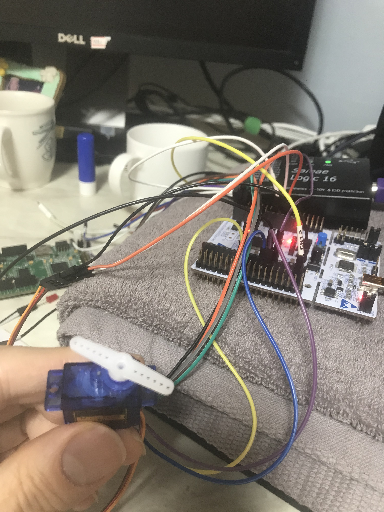
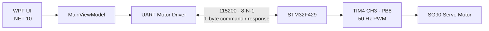

<div align="center">

# STM32 × WPF Servo Motor Controller

**Windows 데스크톱 앱에서 UART로 STM32를 제어하는 서보모터 컨트롤러**


</div>

## 프로젝트 소개

PC의 WPF 애플리케이션에서 시작, 정지, 가속, 감속 명령을 전송하면
STM32F429 펌웨어가 명령을 해석해 SG90 서보모터의 왕복 운동과 속도를 제어합니다.
STM32는 처리 결과를 다시 1바이트로 응답하며, 앱은 현재 속도 단계를 화면에 표시합니다.

<p align="center">
  
</p>

## 주요 기능

- WPF 기반의 다크 테마 모터 제어 UI
- COM 포트 연결 및 연결 해제
- 서보모터 활성화·비활성화
- 1~10단계 속도 조절과 현재 상태 표시
- UART 송수신의 비동기 처리
- STM32 UART 인터럽트 기반 명령 수신
- TIM4 채널 3 PWM을 이용한 0°~180° 왕복 제어

## 시스템 구성



| 구분 | 설정 |
| --- | --- |
| MCU | STM32F429ZITx |
| 서보모터 PWM | `TIM4_CH3` / `PB8` |
| UART | `USART1` / `PA9 (TX)`, `PA10 (RX)` |
| 통신 설정 | 115200 baud, 8 data bits, no parity, 1 stop bit |
| 서보 각도 | 0°~180° |
| 속도 단계 | 1~10 |

## UART 프로토콜

앱은 명령을 1바이트로 보내고, 펌웨어는 적용된 속도 단계를 1바이트로 응답합니다.
정지 명령의 응답값은 `0`입니다.

| 명령 | 값 | 동작 | 응답 |
| --- | ---: | --- | ---: |
| Activate | `0x01` | 왕복 운동 시작 | 현재 속도 |
| Deactivate | `0x02` | 모터 정지 | `0` |
| Accelerate | `0x03` | 속도 1단계 증가 | 변경된 속도 |
| Decelerate | `0x04` | 속도 1단계 감소 | 변경된 속도 |

## 시작하기

### 준비물

- Windows 10/11
- [.NET 10 SDK](https://dotnet.microsoft.com/download/dotnet/10.0)
- Visual Studio 또는 `dotnet` CLI
- STM32CubeIDE
- STM32F429 기반 보드
- SG90 서보모터
- UART 연결 또는 보드의 Virtual COM Port

### 1. 펌웨어 빌드 및 플래시

1. STM32CubeIDE에서 `WPF_Project` 폴더를 기존 프로젝트로 가져옵니다.
2. 서보모터 신호선을 `PB8 (TIM4_CH3)`에 연결합니다.
3. UART 연결과 서보 전원의 GND를 보드 GND와 공통으로 연결합니다.
4. 프로젝트를 빌드한 뒤 보드에 플래시합니다.

> 서보모터는 순간적으로 비교적 큰 전류를 사용할 수 있습니다. 안정적인 별도 5V 전원을 사용하고
> 외부 전원과 STM32 보드의 GND를 반드시 공통으로 연결하는 것을 권장합니다.

### 2. WPF 앱 실행

```bash
cd MotorController/MotorController
dotnet restore
dotnet run
```

앱 상단에 장치의 COM 포트(예: `COM3`)를 입력하고 **Connect**를 누른 뒤
Activate, Deactivate, Accelerate, Decelerate 버튼으로 모터를 제어합니다.

## 프로젝트 구조

```text
.
├── MotorController/
│   ├── MotorController.slnx
│   └── MotorController/        # .NET 10 WPF 앱
├── WPF_Project/
│   ├── Core/                   # STM32 애플리케이션 코드
│   ├── Drivers/                # CMSIS 및 STM32 HAL
│   └── WPF_Project.ioc         # STM32CubeMX 설정
└── README.md
```

## 참고

- WPF 앱의 실제 통신 구현은 `UartMotorDriver`가 담당합니다.
- 하드웨어 없이 UI 로직을 시험하기 위한 `FakeMotorDriver`도 포함되어 있습니다.
- STM32 HAL 및 CMSIS에는 각 디렉터리의 원 라이선스가 적용됩니다.
